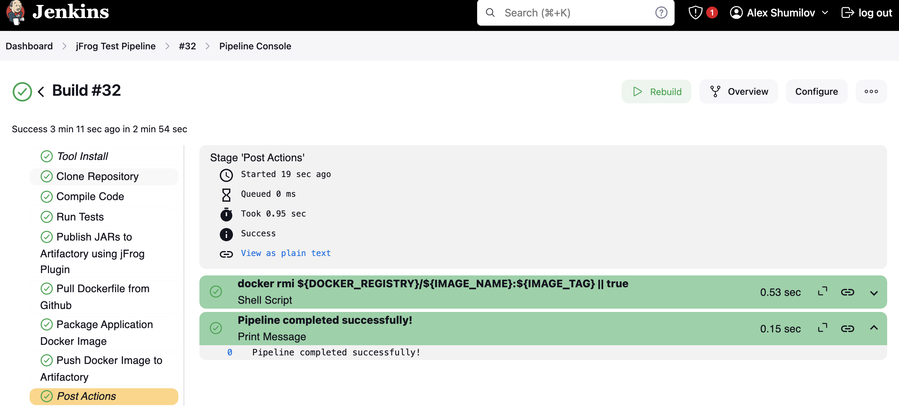

# Jenkins Pipline Exercise

## Jenkins Pipeline steps description

- Pull the source code of [Spring Petclinic Application](https://github.com/spring-projects/spring-petclinic.git) from Github

- Compile the source code

- Run tests

- Push applications jars to jFrog Artifactory using jFrog Jenkins Plugin

- Build docker image using Dockerfile from this repository

- Push image to the registry that emulates Artifactory Docker Registry

## Prerequisites

[Install and configure local Jenkins on Mac](#install-and-configure-jenkins-on-mac-osx)

[Run local Docker registry](#docker-registry)

[Run local jFrog Artifactory Oss](#artifactory)

## Start all services

### Start Jenkins

```bash
brew services start jenkins-lts
```

### Start Artifactory and Local Docker Registry

```bash
docker compose up -d
```

## Configure pipeline

Use `Jenkinsfile` from this repository to configure a new declarative pipeline following steps outlined in [Jenkins Documentation](https://www.jenkins.io/doc/pipeline/tour/hello-world/#:~:text=Click%20the%20New%20Item%20menu,watch%20your%20first%20Pipeline%20run)

## Trigger pipeline

Real life pipeline execution is automatically triggered by the repository source code changes.
For the purpose of this exercie, we manually kick off the pipeline

## Execution Status

Pipeline stages with status can be viewed upon successful run



## Pipeline artifacts

Docker image is availabe in local docker registry and can be pulled

```bash
docker pull localhost:5001/jfrog-test/spring-petclinic:latest
```

## Run the application

```bash
docker run -d -p 8082:8080 localhost:5001/jfrog-test/spring-petclinic:latest
```

## [Install and configure Jenkins on Mac OSX](https://www.jenkins.io/doc/book/installing/macos/)

Install Jenkins using Brew

```bash
brew install jenkins-lts
```

Jenkins start/stop commands

```bash
brew services stop jenkins-lts
brew services start jenkins-lts
```

[Local Jenkins instance](http://localhost:8080/) should be now available

Install plugins required by the pipeline

- Github Plugin
- Docker Plugins (multiple)
- [jFrog Plugin](https://plugins.jenkins.io/jfrog/)
- [jFrog CLI](http://localhost:8080/)
- Gradle Plugin
- Utility Steps Plugin

[Setup Artifactory credentials](https://www.jenkins.io/doc/book/using/using-credentials/) with name `artifactory-credentials-id` providing user and password for the Artifactory

Modify `homebrew.mxcl.jenkins-lts.plist` file as follows to fix Jenkins/Docker Desktop integration
```
<?xml version="1.0" encoding="UTF-8"?>
<!DOCTYPE plist PUBLIC "-//Apple//DTD PLIST 1.0//EN" "http://www.apple.com/DTDs/PropertyList-1.0.dtd">
<plist version="1.0">
<dict>
	<key>Label</key>
	<string>homebrew.mxcl.jenkins-lts</string>
	<key>LimitLoadToSessionType</key>
	<array>
		<string>Aqua</string>
		<string>Background</string>
		<string>LoginWindow</string>
		<string>StandardIO</string>
		<string>System</string>
	</array>
	<key>ProgramArguments</key>
	<array>
		<string>/usr/local/opt/openjdk@21/bin/java</string>
		<string>-Dmail.smtp.starttls.enable=true</string>
		<string>-jar</string>
		<string>/usr/local/opt/jenkins-lts/libexec/jenkins.war</string>
		<string>--httpListenAddress=127.0.0.1</string>
		<string>--httpPort=8080</string>
	</array>
	<key>RunAtLoad</key>
	<true/>
	<key>EnvironmentVariables</key>
	<dict>
	<key>PATH</key>
	<string>/usr/local/bin:/usr/bin:/bin:/usr/sbin:/sbin:/Applications/Docker.app/Contents/Resources/bin/:/Users/hyadav23/Library/Group\ Containers/group.com.docker/Applications/Docker.app/Contents/Resources/bin</string>
	</dict>
</dict>
</plist>
```

## Docker Registry

Artifactory OSS version does not seem to support Docker feature.  I decided to run local docker registry as a standalone componenent to emulate Artifactory feature.

## Artifactory

See `docker-compose.yml` for both registry and artifactory services configurations.
